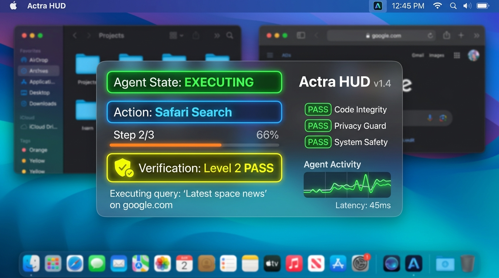

<div align="center">

# ⚡ Actra
### *Autonomous Local-First Computer-Use AI Agent for macOS*

[-000000?style=for-the-badge&logo=apple&logoColor=white)](https://apple.com)
[-555555?style=for-the-badge&logo=apple)](https://apple.com)
[](https://python.org)
[](https://developer.apple.com/swiftui/)
[-black?style=for-the-badge&logo=ollama&logoColor=white)](https://ollama.ai)
[](LICENSE)

<p align="center">
  
</p>

<p align="center">
  <b>Actra</b> bridges high-level natural language goals with native macOS execution—planning actions, orchestrating system subsystems, operating applications semantically, and verifying real-world outcomes with zero cloud telemetry.
</p>

[Key Features](#-key-features) •
[System Requirements](#-system-requirements) •
[Architecture](#-architecture) •
[Quick Start](#-quick-start) •
[Permissions](#-macos-permissions-setup) •
[Usage](#-usage--cli-reference) •
[Tool Catalog](#-built-in-tool-catalog) •
[Configuration](#-configuration-reference)

---

</div>

## 🌟 Overview

Unlike passive chatbots or brittle pixel-based coordinate clickers, **Actra** is an **autonomous, local-first computer-use agent** engineered specifically for macOS. Given an outcome-oriented instruction, Actra orchestrates the operating system through a deterministic multi-tier control hierarchy:

1. **Deterministic APIs & Document Handlers** (Direct file I/O, `openpyxl` Excel engine)
2. **Apple Events & AppleScript Automation** (Deterministic browser control, app lifecycle)
3. **macOS Accessibility Tree (`AXUIElement`)** (Semantic UI element discovery and inspection)
4. **Quartz CGEvent Fallbacks** (Native mouse clicks, keystrokes, modifiers, and scrolling)

Every single operation is bounded by **Trust & Safety Gates** and verified by a **Two-Level Empirical Verification Engine** before concluding.

---

## 🚀 Key Features

* 🔒 **100% Local & Privacy-First** — Powered by local LLMs (e.g., Gemma 4 12B via Ollama / MLX) running entirely on Apple Silicon unified memory. No user queries, file contents, or screenshots ever leave your Mac.
* 🎯 **Deterministic Over Coordinate Guesswork** — Prefers high-fidelity Apple Events, AppleScript, and direct file/data structures over blind coordinate clicking.
* 🔍 **Semantic Accessibility Engine** — Traverses the macOS `AXUIElement` accessibility hierarchy to interact with buttons, fields, and windows semantically.
* 🛡️ **Two-Level Verification Engine**:
  * **Level 1 (Action Verification):** Verifies that the immediate tool invocation returned clean data and produced its intended side-effect.
  * **Level 2 (Goal Verification):** Inspects actual OS state (process tables, active tab URLs, filesystem bytes, spreadsheet contents) to prove the goal was achieved.
* 🔄 **Self-Correction & Autonomous Re-Planning** — When an action or verification check fails, Actra feeds the failure diagnostics back into context and formulates an alternative execution plan.
* 🪟 **Native SwiftUI Liquid-Glass HUD** — A floating, low-profile macOS overlay communicating via Unix domain sockets to display real-time thought streams, execution states, and interactive confirmation modals.
* 🚦 **Granular Safety Taxonomy** — Strict 3-tier classification (`SAFE`, `SENSITIVE`, `DANGEROUS`) with interactive user confirmation for destructive actions (e.g., file deletion, closing apps).
* 🧠 **Episodic SQLite Memory** — Built-in persistent memory store (`~/.actra/memory.db`) allowing cross-session recall and context retention.

---

## 🖥️ System Requirements

| Component | Minimum Requirement | Recommended |
| :--- | :--- | :--- |
| **Operating System** | macOS 14.0 (Sonoma) | macOS 15.0+ (Sequoia) |
| **Processor** | Apple Silicon M1 (8-core) | Apple Silicon M2/M3/M4 (Pro/Max) |
| **Unified Memory** | 16 GB Unified RAM | 32 GB+ Unified RAM (for 12B+ models) |
| **Python** | Python 3.12+ | Python 3.12 via `pyenv` / `brew` |
| **Swift (for HUD)** | Swift 5.9+ / Xcode Command Line Tools | Xcode 16+ |
| **LLM Runtime** | Ollama (`ollama >= 0.6.0`) | Ollama with `gemma4:12b-mlx` |

---

## 🏗️ Architecture

```
                                  ┌──────────────────┐
                                  │   User Request   │
                                  └────────┬─────────┘
                                           │
                                           ▼
                                  ┌──────────────────┐
                                  │   Actra Agent    │◄────────────────────────┐
                                  │  Orchestration   │                         │
                                  └────────┬─────────┘                         │
                                           │                                   │
                      ┌────────────────────┼────────────────────┐              │
                      ▼                    ▼                    ▼              │
             ┌────────────────┐   ┌────────────────┐   ┌────────────────┐      │
             │ Planner (LLM)  │   │ Context & Mem  │   │  Safety Policy │      │
             │ (Ollama/Gemma) │   │ (SQLite Store) │   │ (Trust Gates)  │      │
             └────────┬───────┘   └────────────────┘   └────────────────┘      │
                      │                                                        │
                      ▼                                                        │
             ┌────────────────────────────────────────────────────────┐        │
             │                     Tool Registry                      │        │
             │  Browser • Apps • Filesystem • Excel • Quartz • AX     │        │
             └────────────────────────────┬───────────────────────────┘        │
                                          │                                    │
                                          ▼                                    │
             ┌────────────────────────────────────────────────────────┐        │
             │                 Native macOS Execution                 │        │
             │   Apple Events • PyObjC AXUIElement • CGEvent • openpyxl│       │
             └────────────────────────────┬───────────────────────────┘        │
                                          │                                    │
                                          ▼                                    │
             ┌────────────────────────────────────────────────────────┐        │
             │              Two-Level Verifier Engine                 │        │
             │   Level 1: Action Output   │   Level 2: Live OS State  │        │
             └────────────────────────────┬───────────────────────────┘        │
                                          │                                    │
                         ┌────────────────┴────────────────┐                   │
                         ▼                                 ▼                   │
                  [Checks Passed]                   [Checks Failed]            │
                         │                                 │                   │
                         ▼                                 └───────────────────┘
                  🎯 Goal Complete                            Autonomous Retry
```

---

## ⚡ Quick Start

### 1. Clone the Repository
```bash
git clone https://github.com/Git-ARoy/Actra.git
cd Actra
```

### 2. Set Up Python Environment
```bash
# Create and activate virtual environment
python3 -m venv .venv
source .venv/bin/activate

# Install package in editable mode with development dependencies
pip install -e ".[dev]"
```

### 3. Pull Local LLM Model
Ensure [Ollama](https://ollama.ai) is installed and running:
```bash
# Start Ollama service (if not already running)
ollama serve

# Pull recommended model
ollama pull gemma4:12b
```

### 4. Configure Environment
```bash
cp .env.example .env
```
*(Default settings connect automatically to `http://localhost:11434` with model `gemma4:12b-mlx`).*

---

## 🔐 macOS Permissions Setup

Actra requires explicit macOS privacy permissions to interact with applications, automate input, and capture screen states:

```
System Settings ➔ Privacy & Security
```

| Permission | Subsystem | Purpose | Required For |
| :--- | :--- | :--- | :--- |
| **Accessibility** | `AXUIElement` | UI tree inspection, window hierarchy, coordinate fallback | Terminal / iTerm / Actra |
| **Screen Recording** | `CGDisplayStream` / `screencapture` | Visual observations and screenshot verification | Terminal / iTerm / Actra |
| **Automation** | Apple Events / AppleScript | Direct control of Safari, Finder, and System Events | Terminal / iTerm / Actra |

> **Note:** When running Actra for the first time, macOS may display a system authorization dialog requesting permissions for your terminal emulator. Click **Allow** or toggle the permission on in **System Settings → Privacy & Security**.

---

## 💻 Usage & CLI Reference

### Single Command Execution
Execute a one-off task directly from your terminal:
```bash
# Safari web search & verification
actra "Open Safari and search for WWDC 2026 announcements"

# Filesystem & note creation
actra "Create a folder named Notes in ~/Documents and write a summary.txt inside it"

# Spreadsheet manipulation
actra "Add an expense of $45 for Lunch on 2026-09-22 to ~/Documents/expenses.xlsx"
```

### Interactive REPL Mode
Launch an interactive session with persistent conversational context:
```bash
actra --interactive
```

```text
╔══════════════════════════════════════════════╗
║   Actra — macOS Computer-Use AI Agent        ║
║   Phase 1: Laptop-only Prototype             ║
╚══════════════════════════════════════════════╝

Interactive mode. Type your goal, or 'quit' to exit.

🎯 Goal: Find all pdf files in ~/Downloads
Executing: find_file({'directory': '~/Downloads', 'pattern': '*.pdf'})
💬 Agent: Found 3 PDF files: Q3_Report.pdf, Invoice_99.pdf, Spec.pdf
✨ Status: COMPLETED | Steps: 1
```

### SwiftUI Liquid-Glass HUD
Launch Actra with the native floating status HUD overlay:
```bash
actra "Check Safari active tab" --hud
```

<p align="center">
  
</p>

*(You can also build the HUD standalone via `cd actra-hud && swift build`)*.

### Command-Line Options
```bash
actra [OPTIONS] [GOAL]

Options:
  --interactive, -i             Start interactive REPL session
  --hud                         Launch native SwiftUI Glass HUD overlay
  --no-confirm [none|sensitive|all]
                                Bypass confirmation gates for safety tiers
  --model TEXT                  Override default LLM model name
  --log-level [DEBUG|INFO|WARNING|ERROR]
                                Set console logging verbosity
  --help                        Show help message and exit
```

---

## 🧰 Built-in Tool Catalog

Actra provides 22+ native tools divided into 6 specialized domains:

<details open>
<summary><b>1. Browser Automation (Safari)</b></summary>

| Tool | Parameters | Safety Tier | Description |
| :--- | :--- | :--- | :--- |
| `safari_open` | — | `SAFE` | Opens or brings Safari to front. |
| `safari_navigate` | `url: str` | `SAFE` | Navigates the frontmost tab to a URL. |
| `safari_search` | `query: str` | `SAFE` | Dispatches a search query through default engine. |
| `safari_get_url` | — | `SAFE` | Retrieves the active tab URL. |
| `safari_get_title` | — | `SAFE` | Retrieves active window/document title. |

</details>

<details>
<summary><b>2. macOS Application Management</b></summary>

| Tool | Parameters | Safety Tier | Description |
| :--- | :--- | :--- | :--- |
| `open_application` | `name: str` | `SAFE` | Launches or activates an application by name. |
| `activate_application`| `name: str` | `SAFE` | Focuses an existing application window. |
| `close_application` | `name: str` | `SENSITIVE` | Quits a running application. |
| `list_running_applications` | — | `SAFE` | Returns list of running GUI applications. |
| `get_active_application` | — | `SAFE` | Identifies the frontmost application. |

</details>

<details>
<summary><b>3. Filesystem & Documents</b></summary>

| Tool | Parameters | Safety Tier | Description |
| :--- | :--- | :--- | :--- |
| `find_file` | `directory: str, pattern: str` | `SAFE` | Recursively finds files matching glob pattern. |
| `list_directory` | `path: str` | `SAFE` | Lists directory contents with file metadata. |
| `create_folder` | `path: str` | `SAFE` | Creates folder hierarchy recursively (`mkdir -p`). |
| `create_file` | `path: str, content: str` | `SENSITIVE` | Creates a new file with specified content. |
| `read_file` | `path: str, max_chars: int` | `SAFE` | Reads UTF-8 file content with safe truncation. |
| `write_file` | `path: str, content: str` | `SENSITIVE` | Overwrites or creates file contents. |
| `move_file` | `source: str, destination: str`| `SENSITIVE` | Moves or renames files/directories. |
| `copy_file` | `source: str, destination: str`| `SAFE` | Copies files or directories. |
| `open_file` | `path: str` | `SAFE` | Opens file using macOS default application handler. |
| `delete_file` | `path: str` | `DANGEROUS` | Permanently deletes a file or directory. |

</details>

<details>
<summary><b>4. Structured Data & Spreadsheets (Excel)</b></summary>

| Tool | Parameters | Safety Tier | Description |
| :--- | :--- | :--- | :--- |
| `open_workbook` | `path: str` | `SAFE` | Inspects workbook sheet names and dimensions. |
| `inspect_workbook` | `path: str, sheet: str` | `SAFE` | Reads headers, row counts, and sheet bounds. |
| `append_table_row` | `path: str, sheet: str, values: dict` | `SENSITIVE` | Appends dictionary row mapped to column headers. |
| `save_workbook` | `path: str` | `SAFE` | Persists workbook modifications. |
| `read_last_row` | `path: str, sheet: str` | `SAFE` | Fetches last row for post-write verification. |

</details>

<details>
<summary><b>5. GUI & Quartz Input (Fallback Control)</b></summary>

| Tool | Parameters | Safety Tier | Description |
| :--- | :--- | :--- | :--- |
| `click` | `x: float, y: float` | `SENSITIVE` | Dispatches native mouse click at coordinate. |
| `double_click` | `x: float, y: float` | `SENSITIVE` | Dispatches native mouse double-click. |
| `type_text` | `text: str` | `SENSITIVE` | Types keystrokes into active UI responder. |
| `press_key` | `key: str` | `SAFE` | Presses single key (`return`, `tab`, `escape`). |
| `hotkey` | `keys: str` | `SAFE` | Triggers key combinations (e.g. `command+space`). |
| `scroll` | `amount: int, x: float, y: float` | `SAFE` | Emulates vertical/horizontal scroll wheel. |

</details>

<details>
<summary><b>6. Observation & Inspection</b></summary>

| Tool | Parameters | Safety Tier | Description |
| :--- | :--- | :--- | :--- |
| `take_screenshot` | — | `SAFE` | Captures display image to disk and returns base64. |
| `get_window_info` | — | `SAFE` | Inspects frontmost window bounds and process owner. |
| `inspect_ui` | `max_depth: int` | `SAFE` | Dumps the active window's Accessibility (`AX`) tree. |

</details>

---

## ⚙️ Configuration Reference

Configuration is managed via environment variables or a `.env` file in the project root:

| Variable | Default Value | Description |
| :--- | :--- | :--- |
| `ACTRA_OLLAMA_HOST` | `http://localhost:11434` | Ollama API service endpoint URL |
| `ACTRA_MODEL_NAME` | `gemma4:12b-mlx` | Target reasoning model |
| `ACTRA_NUM_CTX` | `8192` | Model context window length (tokens) |
| `ACTRA_MAX_RETRIES` | `3` | Maximum autonomous re-planning attempts on failure |
| `ACTRA_REQUIRE_CONFIRMATION`| `true` | Enables/disables safety confirmation gates |
| `ACTRA_NO_CONFIRM` | `none` | Policy bypass mode (`none`, `sensitive`, `all`) |
| `ACTRA_LOG_LEVEL` | `INFO` | Console logger level (`DEBUG`, `INFO`, `WARNING`, `ERROR`) |
| `ACTRA_MEMORY_DB_PATH` | `~/.actra/memory.db` | SQLite database file for episodic memory |

---

## 🧪 Testing & Validation

Actra includes comprehensive unit, integration, and Level-2 regression test suites:

```bash
# Run entire test suite
pytest

# Run unit tests only
pytest tests/unit

# Run Safari integration tests
pytest tests/integration/test_safari_workflow.py

# Run Level 2 verification regression suite
pytest tests/test_level2_regression.py -v
```

---

## 📁 Repository Structure

```
Actra/
├── src/actra/
│   ├── agent/                 # Core orchestrator, planner, executor, verifier
│   │   ├── agent.py           # Top-level ActraAgent interface
│   │   ├── planner.py         # Prompt engineering & tool-call parsing
│   │   ├── executor.py        # Safe tool invocation & telemetry
│   │   ├── verifier.py        # Level 1 (Action) & Level 2 (Goal) verification
│   │   ├── context.py         # Conversational history & working memory
│   │   └── memory/            # SQLite episodic memory store
│   ├── llm/                   # LLM engine connectors (Ollama, BaseProvider)
│   ├── mac/                   # Native macOS bridge (PyObjC, AppleEvents, Quartz)
│   ├── tools/                 # Domain tool implementations & safety taxonomy
│   ├── hud/                   # IPC protocol & server for SwiftUI HUD
│   ├── models/                # Pydantic data schemas & contracts
│   └── main.py                # CLI entry point & REPL
├── actra-hud/                 # Native SwiftUI liquid-glass HUD application
│   └── Sources/ActraHUD/      # SwiftUI views, view models, and socket client
├── Project Docs/              # Detailed engineering architecture & specifications
│   ├── ARCHITECTURE.md        # Technical architecture & control hierarchy
│   ├── API_SPEC.md            # Data contracts & tool schemas
│   ├── REQUIREMENTS.md        # System specifications & requirements
│   └── TECH_DECISIONS.md      # Architecture Decision Records (ADRs)
├── tests/                     # Unit, integration, and regression test suites
├── ACTRA_WALKTHROUGH.md       # Comprehensive deep-dive walkthrough guide
├── pyproject.toml             # Python build configuration & dependencies
└── README.md                  # Project overview & documentation
```

---

## 🗺️ Roadmap

- [x] **Phase 1: Local-First Core** — Apple Events, PyObjC `AXUIElement`, Quartz `CGEvent`, openpyxl, Ollama Gemma 4 integration.
- [x] **Two-Level Empirical Verification** — Action & Goal verification engine with automatic re-planning.
- [x] **Native SwiftUI HUD** — Low-profile status overlay with real-time thought streams and confirmation gates.
- [ ] **Phase 2: Voice Stack** — Local Voice Activity Detection (VAD), fast wake-word (`"ACTRA"`), streaming local Whisper/TTS.
- [ ] **Expanded Adapters** — Deep application adapters for Mail, Notes, Slack, Music, and VS Code.
- [ ] **Multimodal Visual Fallback** — Localized object detection and OCR for canvas-based UIs without AX trees.

---

## 📄 License

This project is licensed under the MIT License — see the [LICENSE](LICENSE) file for details.
